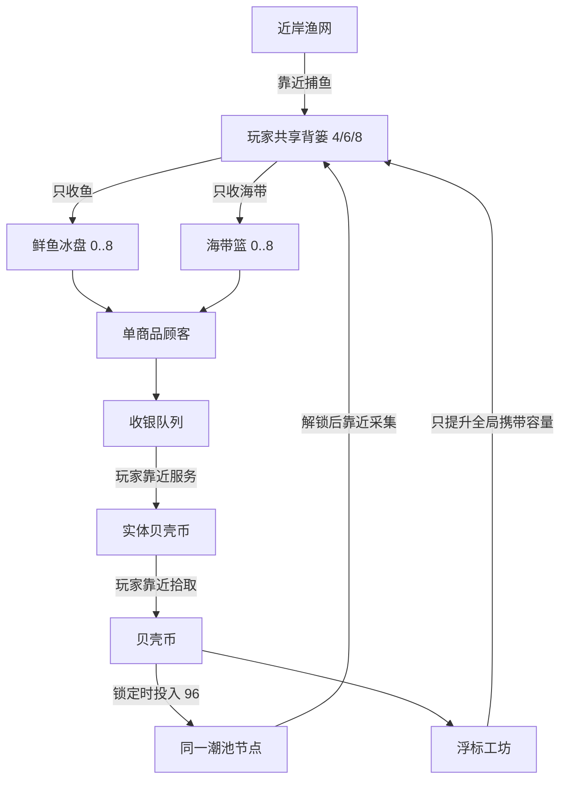

# 海滩渔货铺：虾 / 螃蟹扩展设计评审

状态：**PROPOSED — AWAITING APPROVAL**  
唯一 Run：`runs/20260830210424-pawshop-v1`  
游戏 Workspace：`runs/20260830210424-pawshop-v1/workspace/game`  
边界：本轮未修改游戏代码、配置、测试或素材；未启动 BuilderAgent / FixerAgent；未生成正式素材；未实现虾或螃蟹。

## 结论先行

推荐 **方案 B：批量虾笼与低频蟹笼**。

- 鱼继续承担高频、稳定、最好理解的基础现金流。
- 海带继续承担第一次空间投建与需求扩张，不改变现有已验证行为。
- 虾在 3–8 分钟出现，用“营业中蓄货、两只一批、站点最多存四只”改变玩家路线：不再原地复制捕鱼，而是离开后回来按批收取。
- 螃蟹在 8–15 分钟出现，用“慢速就绪、基础只存一只、低频高价值”建立长周期回访点。
- 四类商品全部占一个背篓格。新品差异来自设施节奏、货架容量和顾客行为，不来自重量算术。
- 背篓升级移到独立 icon；渔网、虾笼、蟹笼升级只在各自设施旁显示，并各自只表达一个升级轴。

方案 B 比方案 A 多出站点计时器、可见缓存和一次换购状态，因此实现、测试和迁移成本中等；但这是能让虾和螃蟹不沦为“换贴图的鱼”的最小结构变化。

## 已核验基线

实际打开了当前 `dist`，以 Chromium 390×844 运行并截图：

- [当前 Demo 截图](screenshots/current-demo-390x844.png)
- [当前问题标注图](screenshots/current-demo-390x844-annotated.png)

读取并核对：

- `economy.ts`：鱼奖励 4 / 采集 520ms；海带奖励 6 / 采集 650ms；共享容量 4→6→8；单货架 8；顾客和收银节奏。
- `simulation.ts`：真实站点、状态、采集/补货/顾客/收银/币/升级与保存归一化。
- `main.ts`：场景绘制、站点位置、引导线、HUD、触控移动、角色动画与测试接口。
- `view-model.ts`：所有当前站点文案，以及“浮标工坊”对“携带容量”的真实映射。
- `persistence.ts`：save-v4、真实旧键迁移、刷新恢复和节流写入。
- 相关 50 项测试及 v5 build/QA 证据。
- v5 open-source-research、game-blueprint、economy-config、build-report、最终 QA 与动画 QA。

当前 web-lite 只是浏览器开发/QA 证据；不代表微信、抖音或 TapTap 包可发布。

## 当前真实经营关系

关键事实：**渔网没有任何升级状态或升级边。** 当前 `upgrade` 节点只提升玩家共享携带容量。

## “漂浮工厂”真实用途与误读原因

用户看到的“漂浮工厂”在源码中的文案是“浮标工坊”，内部是 `STATIONS.upgrade`。它的真实行为只有：

1. 花 40 贝壳币，把玩家共享携带容量从 4 升到 6。
2. 海带解锁后花 88 贝壳币，从 6 升到 8。
3. 不改变渔网速度、产量、储量或品质。

难以理解不是单一命名问题，而是四个信号叠加：

1. 玩家全局能力被做成地图中的大型生产型建筑。
2. 顶部 HUD 同时又显示“携带 0/4、下一档 6·40”，一个概念占了 HUD 和设施两个层级。
3. `main.ts` 从左上渔网方向画出连续引导线，经店区指向右下工坊，形成一条“渔网产业链”的视觉阅读。
4. 手机画面底部状态卡会竞争工坊标签空间，玩家先看到建筑/图形，后看到或看不清它提升的是携带容量。

因此修正必须是结构性的：

- 背篓升级离开世界设施，进入独立背篓 icon。
- 渔网若有升级，只在渔网旁显示，并写清“捕捞速度 +15%”等唯一轴。
- 虾笼、蟹笼同样只表达自己的局部升级。
- 不再用一座建筑同时代表玩家能力和生产设施。

## 四种商品的经营定位

| 商品 | 定位 | 建议出现 | 生产关系 | 单次产量 | 背篓占位 | 货架 | 顾客作用 |
|---|---|---:|---|---:|---:|---:|---|
| 鲜鱼 | 高频基础现金流 | 开局 | 保持靠近连续捕鱼 | 1 | 1 | 8 | 最大需求权重、换购基底 |
| 海带 | 高频第一扩张 | 约 2.5–4 分钟 | 保持原地投建后靠近采集 | 1 | 1 | 8 | 提升总客流，完成第一次品类分流 |
| 鲜虾 | 中期批量商品 | 约 5–7 分钟 | 营业中虾笼蓄货，回来批量收取 | 2；站点最多 4 | 1 | 6 | 中等需求，缺货可换购一次 |
| 礁蟹 | 低频高价值商品 | 约 10–12 分钟 | 慢速蟹笼就绪，基础只存 1 | 1；升级后最多 2 | 1 | 3 | 小比例高价值需求，等待更久且不换购 |

### 为什么都占一个格

让螃蟹占两个格看似更“真实”，但会引入：半批次能否收取、堆叠如何表达、旧背篓 4 格如何规划、混装如何提示、货架空位与背篓空位的两套算术。当前移动和补货的强项是“靠近就懂”。

推荐所有商品一单位一格，把差异放到玩家更容易看到的地方：

- 虾：一次拿到两只，但必须回来等批次。
- 螃蟹：很慢、一次一只、货架很小、售价高。
- 背篓仍然是一条统一的共享容量约束。

这样容量 4 仍能完成一次虾批次并保留两格混装空间，不会破坏现有短距离补货节奏。

## 设施与升级归属

| 对象 | 所有者 | 入口 | 本阶段唯一升级轴 | 明确不做 |
|---|---|---|---|---|
| 背篓 | 玩家 | 右下快捷区独立背篓 icon | 全局共享容量 | 不做成场景建筑 |
| 近岸渔网 | 设施 | 渔网交互圈旁 | 捕捞速度 | 不改背篓、不同时升级产量/品质 |
| 潮池海带点 | 设施 | 潮池本体 | 本阶段暂不加升级 | 解锁进度不冒充设施等级 |
| 浅滩虾笼 | 设施 | 虾笼就绪指示旁 | 浸泡速度 | 不影响全局生产 |
| 礁边蟹笼 | 设施 | 蟹笼就绪指示旁 | 待取上限 1→2 | 不同时提升速度/售价/品质 |
| 货架 | 店铺 | 各自货架 | 本阶段不升级 | 不与生产设施共用提示 |
| 收银台 | 店铺 | 收银台 | 本阶段不升级 | 不争夺主目标提示 |

升级出现规则：玩家先体验设施至少一个完整循环，再显示本设施的局部升级提示。提示只包含“设施名 + 一个轴 + 一个成本”。

## 解锁顺序与界面目标

推荐顺序：**鱼 → 海带 → 虾 → 螃蟹**。

1. 鱼：开局可用；主目标是卖出第一份鱼。
2. 海带：完成首售后，继续使用当前已经可见的潮池投建。保持 96 的现有门槛。
3. 虾：海带解锁后才显露锁定剪影；以约 16–22 次累计售卖为调参区间，首轮建议 18 次。完成后才显示虾笼投建价格。
4. 螃蟹：虾笼启用前不显示条件；启用后以约 8–12 次虾销售为区间，首轮建议 10 次。

UI 一次只表达：

- 一个主要文字目标，例如“售出鲜虾 6/10”。
- 一个次要信号，例如背篓可升级红点。

如果已经有次要红点，就不再显示另一张次要文字卡。虾和螃蟹的锁定条件永远不同时出现。

## 顾客与货架

四种商品各自拥有独立货架。共享货架会让玩家无法快速判断卸货兼容性，也会破坏当前“对应货架”的清晰学习。

全部品类解锁后的首轮需求权重建议带宽：

- 鱼：45%–52%。
- 海带：22%–28%。
- 虾：18%–24%。
- 螃蟹：8%–12%。

这是调参区间，不是最终固定比例；未解锁品类从池中移除后重新归一化。

缺货行为：

- 鱼/海带：保持当前等待后离开。
- 虾：等到一半耐心后，只允许一次换购，优先拿已有库存的鱼或海带；没有替代库存则继续等待，超时离开。
- 螃蟹：耐心比基础顾客更长，但不换购。这样玩家会明确感知“高价值货缺了”，而不是把螃蟹当作另一个随机收入数。

安全阀：保留当前全局活跃顾客上限，另限制新品缺货等待者数量；新品需求只在来源与货架原子式启用后开始。

## 相对经济与回本区间

定义：

- `F-cycle` = 当前捕鱼 520ms。
- `F-price` = 当前鲜鱼售价 4。
- `K` = 当前海带投建 96。

| 商品 | 生产周期 | 产量 | 售价 | 货架 | 解锁成本 | 设施升级 | 目标回本 |
|---|---:|---:|---:|---:|---:|---:|---:|
| 鱼 | 1.0 F-cycle | 1 | 1.0 F-price | 8 | 开局 | 10–14 份鱼收入，速度档 | 2.5–4 分钟 |
| 海带 | 1.15–1.35 F-cycle | 1 | 1.35–1.65 F-price | 8 | 1.0 K | 本阶段无 | 解锁 2.5–4.5 分钟 |
| 虾 | 6.5–9.5 F-cycle / 两只 | 2，缓存 4 | 1.75–2.25 F-price | 5–6，建议 6 | 1.4–1.8 K | 8–12 份虾收入，快 15%–20% | 3–5 分钟 |
| 蟹 | 17–25 F-cycle / 一只 | 1，缓存 1→2 | 3.0–4.0 F-price | 3–4，建议 3 | 2.4–3.2 K | 6–9 份蟹收入，缓存 1→2 | 4–6 分钟 |

检查项：

- 买完设施后不能让玩家失去所有可产生收入的路径；鱼始终免费可用。
- 不能要求先卖虾/蟹，才能解锁生产虾/蟹的设施。
- 虾笼满 4、蟹笼满 1/2 后停止，不累计隐藏溢出。
- 新品客流不得早于新品来源与货架启用。
- 用固定随机种子跑 15 分钟，检查最低余额、满载时长、空架时长、顾客离开、最长队列和回本。

## 前 15 分钟节奏

### 0–3 分钟

只突出捕鱼闭环与潮池投建。保留当前首客 22 秒、首售 25–40 秒目标窗。玩家能付 40 时，背篓 icon 可出现红点，但不得用它盖过“解锁潮池”主目标。虾、蟹不出现文案。

### 3–8 分钟

玩家平衡鱼与海带，并完成熟悉的累计售卖目标。约 5–7 分钟启用虾笼。第一次看到“蓄成 2/4”并按批拿货；虾需求启用。蟹只保留安静地形或完全隐藏，不显示价格与条件。

### 8–15 分钟

玩家通过卖虾解锁蟹笼，约 10–12 分钟获得第一只蟹。螃蟹的低频高价迫使玩家保留基础商品供给，不能替代鱼/海带。15 分钟前不再增加第五种商品、员工或新科技树。

## UI 语义规则

### 背篓 icon

- 放入现有右下快捷菜单，作为第一个 44px 圆形按钮，继续尊重 bottom/right safe area。
- 外形是背篓，不带建筑底座、生产圈、渔网或浮标元素。
- 仅在“有下一档 + 前置完成 + 余额足够 + 非满级”时显示红点。
- 点击只打开紧邻 icon 的小卡：当前容量、下一容量、一个价格、一个确认动作。
- 玩家开始拖动移动或点击卡外时关闭。

### 设施提示

- 渔网：`捕捞速度 +15% · cost`。
- 虾笼：`浸泡时间 X→Y · cost`。
- 蟹笼：`待取上限 1→2 · cost`。

提示贴近设施，但放在交互圈外；不叠在路线、角色头顶堆叠或 HUD 排除区。未真实支持升级时，不显示假升级箭头。

### 竖屏信息预算

- 不在顶部永久塞入四个库存计数。
- 货架本地继续显示库存/上限。
- 顶部现有库存条在第三商品出现后最多显示两个紧急运营信号，例如“最低库存”和“已就绪设施”；具体视图须在实现审批后另做 RED UI 契约。
- 360×800、390×844、430×932 都要验证无横向溢出、状态卡/快捷区不重叠、44px 触控目标和拖动区域可用。

## 方案 A：低复杂度扩展

虾和蟹都复用当前“站近 → 逐个采集 → 对应货架 → 单商品顾客”流程。区别仅为周期、售价、货架容量、位置和需求权重。所有设施第一档都升级速度。

| 维度 | 评价（1低–5高） | 说明 |
|---|---:|---|
| 玩家理解成本 | 1 | 几乎无需新学习 |
| 新鲜感 | 2 | 主要是新路线与数值 |
| 实现成本 | 2 | 可参数化现有系统 |
| 测试成本 | 2 | 可扩展既有测试矩阵 |
| 存档迁移风险 | 2 | 没有设施缓存 |
| 移动端 UI 风险 | 3 | 仍需摆下四源四架 |
| 后续扩展性 | 2 | 再加商品会越来越同质 |

优点是快、稳、易懂。主要缺点是虾和蟹很可能只是慢一点、更贵一点的鱼，无法满足“新的经营关系”。

## 方案 B：中等复杂度扩展（推荐）

保留运输到收银的所有已知关系，只改变来源：虾笼营业中按批蓄货，蟹笼慢速就绪并受待取上限约束。升级轴也因此不同。

| 维度 | 评价（1低–5高） | 说明 |
|---|---:|---|
| 玩家理解成本 | 3 | 学习“就绪/缓存”，但不学重量 |
| 新鲜感 | 4 | 路线规划从驻留变为回访 |
| 实现成本 | 3 | 新增计时器、缓存、可视状态 |
| 测试成本 | 4 | 要覆盖封顶、迁移、换购和队列 |
| 存档迁移风险 | 3 | 新设施状态是权威数据 |
| 移动端 UI 风险 | 3 | 就绪状态必须本地呈现 |
| 后续扩展性 | 4 | 未来商品可选择不同来源模式 |

推荐理由：它只增加两种非常局部的新状态，却让虾和螃蟹分别改变“何时去拿货”和“是否值得绕路”，同时不触碰当前最成熟的移动、背篓、对应货架、顾客、收银、拾币和角色动画结构。

## 存档迁移影响

若获批，建议显式升级到 save-v5（最终版本号在实现设计中锁定），增加：

- `carrying/shelves` 的 shrimp、crab 字段。
- 虾笼的 unlocked/invested/buffer/soak timer。
- 蟹笼的 unlocked/invested/ready count/ready cap/latch timer。
- 各设施升级等级。
- 各商品完成售卖计数与下一目标。
- 顾客商品枚举与 `substitutionUsed`。

旧 save-v4 默认新品库存 0、设施锁定、升级 0，保留所有鱼/海带、潮池进度、顾客、队列、实体币、ID、随机种子、遥测与玩家位置。必须用显式 v4→v5 纯迁移，不依赖缺字段猜测；真实 save-v3→v4 链仍要通过。

风险等级：**中**。最危险的不是新增字段，而是误删运行中的鱼/海带顾客、队列和 token。

## RED-first 测试计划

1. 生产：虾每周期恰好 +2、到 4 停止；蟹每周期 +1、到 ready cap 停止；升级只改声明轴。
2. 背篓/货架：四品共享容量、一单位一格、不可串货、满架不吞背篓货。
3. 顾客：新品未解锁需求为 0；虾最多换购一次；蟹不换购；等待者与总顾客上限有效。
4. 解锁：鱼→海带→虾→蟹不可跳；一次只展示下一条件；不可能要求未生产商品。
5. UI 所有权：背篓 icon 只改容量；渔网只改速度；虾只改浸泡；蟹只改缓存。
6. 迁移：真实 save-v3、当前 save-v4、新 save-v5 刷新回环；现有运行中顾客、队列、token 全保留。
7. 移动端：三个竖屏尺寸、safe area、44px、无溢出、拖动不被提示截获。
8. 回归：现有鱼/海带闭环、50 项基线、角色三方向 8 帧与 reduced-motion 不退化。

实现阶段的完成门禁仍是 lint、typecheck、全量测试、build 和机器可读浏览器 QA；任何平台包需在各自 adapter/config/test/evidence/build 目录中独立验证。

## 待审批事项（最多三项）

1. 是否批准方案 B 作为实现基线：虾是营业中蓄成两只一批，蟹是慢速单就绪槽？**建议批准。**
2. 是否批准四品都占一格，虾架首轮 6、蟹架首轮 3？**建议批准。**
3. 是否批准虾缺货只换购一次、蟹等待更久但不换购，并落在 3–8 / 8–15 分钟解锁窗？**建议批准。**

## 实现门禁

当前 `approved = false`。只有用户明确回复 **APPROVE** 后，才允许进入实现准备；在此之前不得修改游戏、生成正式素材或启动 BuilderAgent / FixerAgent。

